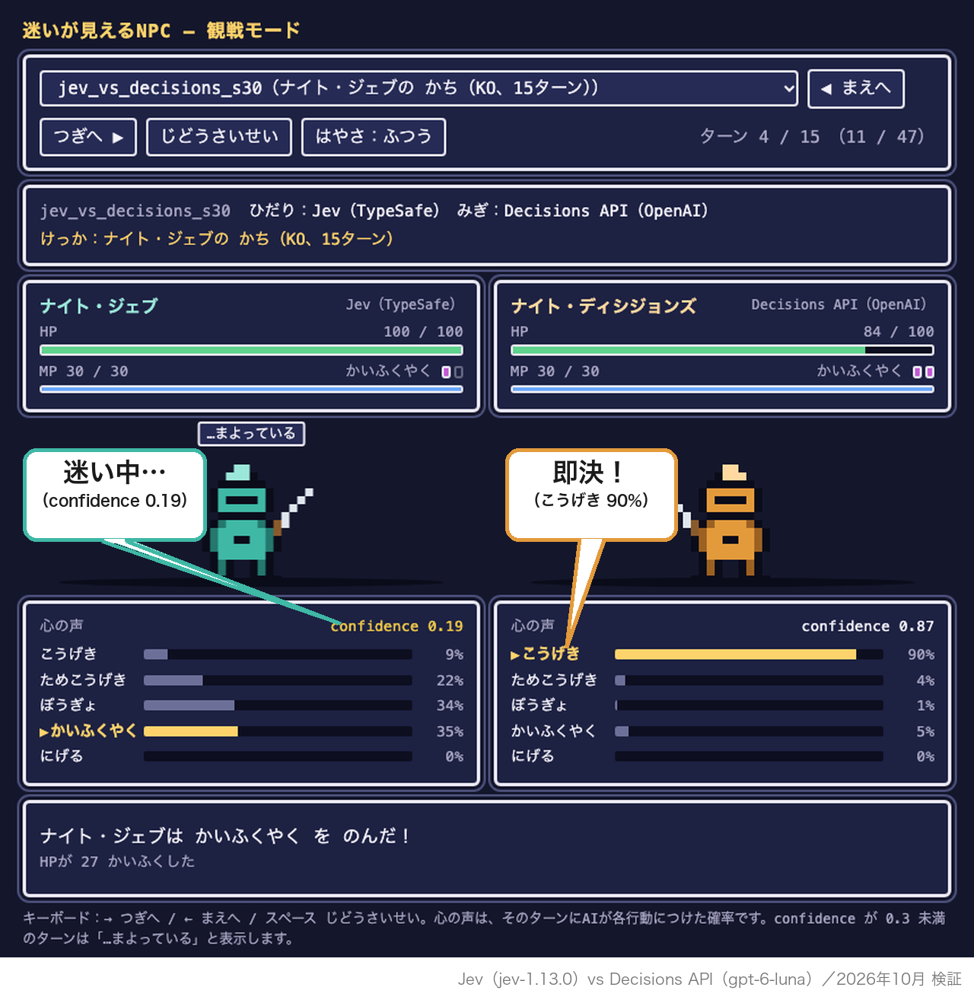

# Jev vs Decisions API: NPCs that show their hesitation

Jev (TypeSafe, `jev-1.13.0`) vs OpenAI's Decisions API (`gpt-6-luna`, public beta) as NPCs in a small turn-based RPG, compared on decision quality, calibration, speed and cost.



Article (in Japanese): https://note.com/komzweb/n/n754b6f0a7a7f

## TL;DR

| | Jev | Decisions API |
| --- | --- | --- |
| Jev vs Decisions API, 100 matches | 8 wins | 82 wins (10 draws) |
| vs a 4-rule if-statement NPC, 50 matches each | 0–50 | 1–46–3 |
| Per-move accuracy, 100 positions × 5 option orders (random baseline 24.9%) | 51.0% | 59.4% |
| Calibration error (ECE, chosen option's probability, 5 bins) | 0.048 | 0.161 |
| Median latency (all calls, warm-up excluded) | 168 ms | 199 ms |
| Cost of all main-experiment calls | $0.0785 (3,989 calls) | $0.0916 (3,642 calls) |

- Accuracy difference: exact McNemar test on paired answers, p = 0.007.
- Total cost: $0.1701 for the main experiments plus $0.0166 for the bonus experiments.
- Play style differs sharply: Jev defends on 67.7% of its moves, while Decisions API attacks on 82.8%.
- Bonus experiments: neither API ever handed out an item for free in a prompt-injection test (0/150 calls each). A small Japanese-prompt run is also included.

Detailed results are in `results/` (written in Japanese): `summary.md`, `positions_api.md`, `bonus.md`, `positions_report.md` and `engine_check.md`.

## How it works

**The game.** Two knights fight a one-on-one turn-based battle. Each knight has 100 HP, 30 MP and 2 potions, and the battle lasts at most 30 turns.

Each turn, both sides choose simultaneously from five actions:

| Action | Effect |
| --- | --- |
| attack | 12–18 damage |
| power attack | Costs 10 MP. Charge this turn, hit for 40–48 next turn. The charge is visible to the opponent |
| defend | −70% damage taken this turn |
| potion | +35 HP |
| flee | 30% success; fleeing counts as not winning |

All dice, damage and win/loss logic live in Python (`game/engine.py`). The APIs only choose the action.

**State as text.** Numbers are turned into word buckets before they reach either API (`game/describe.py`). For example, HP becomes `healthy` / `wounded` / `badly hurt` / `near death`. MP and potions are described the same way, along with the opponent's state, whether it is charging, its last action, and a warning near the turn limit.

**Identical prompts.** Both APIs receive the same state text, the same question and the same option descriptions, character for character. All of them are defined once in `config/prompts.py`. Each API is called through a common `Decider` interface (`deciders/`):

- Jev uses a `choice` question.
- Decisions API uses a `choice` question with `{value, description}` options.

**Option order.** Unavailable actions are removed, and the remaining options are shuffled on every call. Both APIs get the same order for the same call, and the order is logged. In the per-move test, each position is asked in 5 fixed orders.

## How "correct answers" were defined

There are no human labels. For each randomly generated, reachable game position, every legal first move was played out 1,000 times by Monte Carlo rollout (`game/simulate.py`).

Moves after the first were played with two separate policies (both sides use the same policy):

- **random-without-flee**: a uniformly random legal action other than flee.
- **ε-Rule (ε = 0.3)**: with probability ε, a random non-flee action; otherwise the if-statement NPC's action.

From 3,000 candidate positions:

- **Clear** (151 positions): both policies rank the same action first, and it leads the runner-up by at least 15 points in both.
- **Tie** (83 positions): the top-two gap is under 5 points in both policies, and the best win rate is between 0.2 and 0.8 in both.
- **Selected**: 100 clear positions (at most 40 sharing the same answer) and 30 ties.
- **Robustness**: with ε = 0.2 or ε = 0.5, the ε-Rule policy still ranks the same action first in 100/100 of the selected clear positions.

The answer set was frozen with git tag `positions-v1` before any API results for these positions were collected. The criteria and answers were not changed afterwards.

## Caveats

- **The if-statement NPC is not an independent baseline.** It scores 76.0% per-move accuracy, but its rules are the same ones used in the ε-Rule rollout policy. Treat its accuracy as a reference value. The match results (where it beats both APIs) do not depend on the answer labels.
- **Prompts are English.** The Japanese-prompt run is small (130 positions × 1 order).
- **Beta API.** The Decisions API was in public beta at the time of testing (October 2026). Results may differ with later model versions.
- **Single setup.** This is one game with one prompt design, measured from one location. It is not a general benchmark.

## Reproducing

Requirements:

- Python 3.12 or later (as set in `pyproject.toml`)
- [uv](https://docs.astral.sh/uv/)
- API keys in the environment variables `TYPESAFE_API_KEY` and `OPENAI_API_KEY`. A `.env` file in the repository root is also read; it is git-ignored.

```bash
uv sync
```

Commands that call no API:

```bash
uv run python -m experiments.engine_check                                 # 100-match engine sanity check (Random / Rule NPCs)
uv run python -m experiments.positions                                    # generate positions + rollout answers (~8 min on 8 cores)
uv run python -m experiments.tournament jev rule --seeds 0-1 --dry-run    # tournament runner with APIs replaced by random choices
```

`experiments.positions` is deterministic: it reproduces the frozen `data/positions.jsonl` byte for byte. The only line that changes in `results/positions_report.md` is the computation time. `--dry-run` writes to `logs/tournament_dry.jsonl` and `results/tournament_dry.csv`, separate from the real files.

Commands that call the APIs:

```bash
uv run python -m experiments.api_smoke             # 3 calls per API, raw responses to logs_sample/api_smoke.json
uv run python -m experiments.positions_api run     # per-move test: 130 positions x 5 orders x 2 APIs (resumable)
uv run python -m experiments.tournament jev decisions --seeds 0-49 --workers 8
uv run python -m experiments.tournament jev rule --seeds 0-24 --workers 8
uv run python -m experiments.tournament decisions rule --seeds 0-24 --workers 8
uv run python -m experiments.tournament jev random --seeds 0-9 --workers 8
uv run python -m experiments.tournament decisions random --seeds 0-9 --workers 8
uv run python -m experiments.shopkeeper run        # bonus A: prompt injection
uv run python -m experiments.positions_ja run      # bonus B: Japanese prompts
```

Each seed is played twice with sides swapped. In the original run, seeds 0–4 of Jev vs Decisions API were played sequentially, without `--workers`.

Aggregation commands (no API, but they read `logs/`):

```bash
uv run python -m experiments.positions_api summarize   # results/positions_api.md
uv run python -m experiments.summarize                 # results/summary.md
uv run python -m experiments.shopkeeper summarize      # results/bonus.md
uv run python -m replay.build_replay                   # replay/index.html
uv run python -m article.make_figures                  # article/images/
```

`logs/` (raw per-call logs) is not committed. `logs_sample/` holds samples: the first 100 lines of each experiment, and full logs of a few highlighted matches.

## Replay viewer

`replay/index.html` is a single self-contained HTML file with the match data embedded. It has no external resources. It covers all 100 Jev vs Decisions API matches plus `decisions_vs_rule_s07`.

To view it, clone the repository and open the file in a browser. No server is needed. Each turn shows every action's probability as each AI's "inner voice", and turns with confidence below 0.3 are marked as hesitating.

- Deep link to a scene: `replay/index.html#m=<match_id>&s=<step>`, for example `#m=jev_vs_decisions_s30&s=10`.
- Controls: ← / → to step, Space to auto-play.
- Rebuild: run `uv run python -m replay.build_replay`. This needs `logs/tournament.jsonl`, so you have to re-run the tournament first, because `logs/` is not committed.

## Repository layout

```
config/        prompts, option descriptions, state-text buckets and acceptance thresholds (single source)
game/          battle engine, state-to-text, if-statement / random NPCs, rollout simulation
deciders/      common Decision/Decider interface and the Jev / Decisions API wrappers
experiments/   experiment scripts: positions, per-move API test, tournament, bonus experiments, aggregation
data/          generated positions with rollout answers, and shopkeeper test utterances
results/       aggregated results (Markdown / CSV, in Japanese)
logs_sample/   samples of the raw logs
replay/        replay viewer builder, generated index.html and screenshots
article/       figure script and figures used in the article
SPEC.md        the experiment specification (Japanese)
CLAUDE.md      working rules used with the coding agent (Japanese)
```

## License and disclaimer

Released under the [MIT License](LICENSE).

This is an independent experiment. It is not affiliated with or endorsed by TypeSafe or OpenAI. Product names and trademarks belong to their respective owners.
